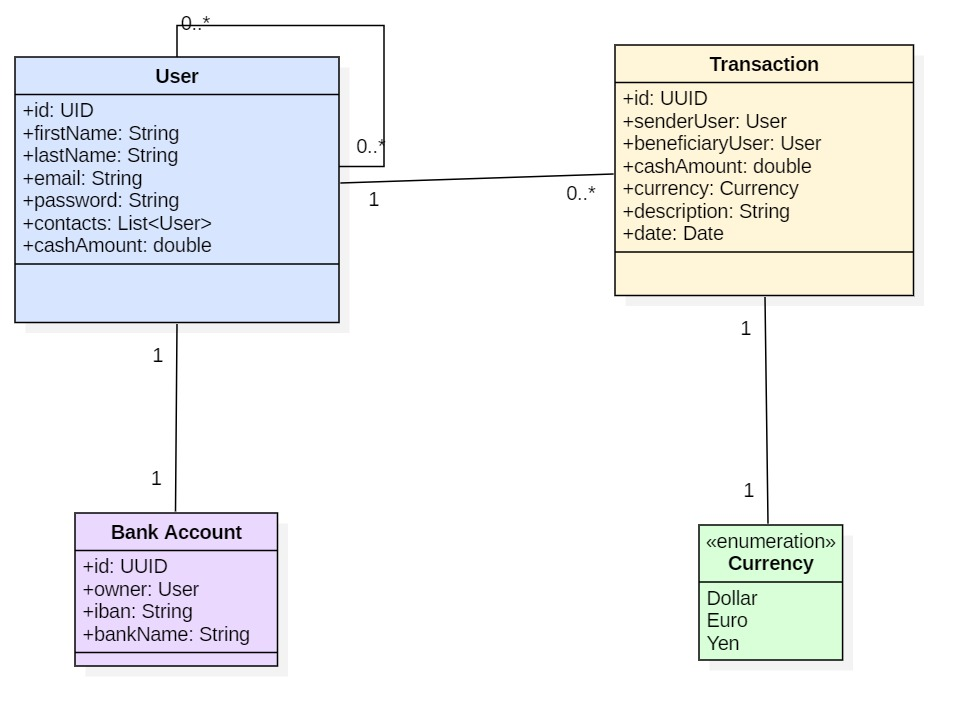

# WebPay App by PayMyBuddy

WebPay is a web application designed to make money transfer easier.

### Data Model

Here is the domain model diagramm of the app.

### Database scripts

The main database script is located at src/main/resources/webpay.sql

### Implementation of the App

Source code of the app start at src folder. 
You will find repository pattern and customized api.

